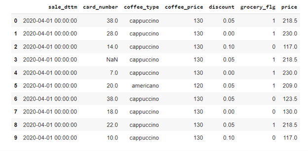

# Практика по SQL 13.10
Студент: Яковлев Дмитрий Алексеевич МСМТ-224
## Задание 1.
Напишите, как минимум 2 способами скрипт, оставляющий только уникальные значения в таблице:
<table>
<tr><td>tab</td></tr>
<tr><td>col1</td><td>col2</td><td>col3</td></tr>
</table>
Под уникальными значениями подразумеваю полностью уникальные строки. 

```sql
-- 1) GROUP BY
SELECT col1, col2, col3
FROM tab
GROUP BY col1, col2, col3
;

-- 2) DISTINCT
SELECT DISTINCT col1, col2, col3
FROM tab
;
```

## Задание 2.
Напишите запрос, возвращающий последнее событие для каждого типа событий (type):
<table>
<tr><td>events</td></tr>
<tr><td>type</td><td>date</td><td>col1</td><td>col2</td></tr>
</table>

```sql
SELECT type, MAX(date), col1, col2
FROM events
GROUP BY type
;
```

## Задание 3.
Напишите скрипт обновляющий значение AMOUNT в таблице BALANCE на основании данных из таблицы OPERATIONS за текущий день.
<table>
<tr><td>balance</td></tr>
<tr><td>[pk] account</td><td>amount</td></tr>
</table>

<table>
<tr><td>operations</td></tr>
<tr><td>date</td><td>account</td><td>amount</td></tr>
</table>

```sql
WITH operations_today AS (
    SELECT account, amount
    FROM operations 
    WHERE date = CURRENT_DATE
)
UPDATE balance
SET amount = balance.amount + operations_today.amount
FROM operations_today
WHERE balance.account = operations_today.account
;
```


## Задание 4.
Какие способы соединений таблиц Вы знаете? В чём их особенности, преимущества и недостатки?
<table>
<tr>
<td>JOIN type</td>
<td>Описание</td>
</tr>
<tr>
<td>INNER</td>
<td>
    Только совпадения те строки, которые удовлетворяют предикату в ON.
    Не все строки каждой таблицы могут быть задействованы.
</td>
</tr>
<tr>
<td>OUTER LEFT or LEFT и OUTER RIGHT or RIGHT</td>
<td>
    Все строки гарантированно (левой ИЛИ правой) таблицы будут в результирующем соединении. Не найденным строкам пар, будут сопаставлены с NULL кортежом.
</td>
</tr>
<tr>
<td>FULL OUTER or FULL or OUTER</td>
<td>
    Все строки гарантированно (левой И правой) таблицы будут в результирующем соединении. Не найденным строкам пар, будут сопаставлены с NULL кортежом.
</td>
</tr>
<tr>
<td>CROSS</td>
<td>
    Декартово произведение. Все строки соединяются из одной таблицы с другой, формируя двудольный граф. 
</td>
</tr>
</table>


## Задание 5.
Сколько записей будет удалено из таблицы ниже в результате выполнения выражения: 
```sql
delete from table_name where age=null
```
Предложите варианты корректного написания
<table>
<tr>
<td>id</td><td>name</td><td>age</td>
</tr>
<tr>
<td>45898</td><td>Исаак Ньютон</td><td>85</td>
</tr>
<tr>
<td>1256</td><td>Чарльз Дарвин</td><td>null</td>
</tr>
<tr>
<td>255</td><td>Галилео Галилей</td><td>78</td>
</tr>
<tr>
<td>48</td><td>Карл Маркс</td><td>null</td>
</tr>
</table>

Ответ:
* Количество удалённых строчек будет зависеть от СУБД. Может удалиться всё или ничего поскольку сравнивания с пустотой неккоректно, нужно использовать оператор ```IS NULL```.
* В некоторых СУБД ```NULL``` это пустая строка. Поэтому если поле ```age``` в такой СУБД имеет тип данных ```TEXT```(```VARCHAR```, ```CHAR``` и т.д), можно ожидать выполнение ```DELETE``` для **2 строк**. 

## Задание 6.
Есть таблица с данными по продажам кофе:
<table>
<tr>
<td>
SALE_DTTM – точное время продажи,
</td>
</tr>
<tr>
<td>
CARD_NUMBER – номер скидочной карты
</td>
</tr>
<tr>
<td>
COFFEE_TYPE – название проданного кофейного напитка
</td>
</tr>
<tr>
<td>
COFFEE_PRICE - цена напитка
</td>
</tr>
<tr>
<td>
DISCOUNT – размер скидки в %
</td>
</tr>
<tr>
<td>
GROCERY_FLG – флаг покупки выпечки в том же чеке
</td>
</tr>
<tr>
<td>
PRICE – полная стоимость
</td>
</tr>
</table>


 
какие ошибки допущены при проектировании таблицы?
какие ошибки, вероятно, были на источнике?
какие шаги можем сделать для того, чтобы лучше понять данные?

Ошибки
* Нету времени, хотя формат предпологается ```yyyy-mm-dd HH::MM::SS```
* Нехватает поле Чека операции, что-то вроде ```check_id```, для корректной идентификации


## Задание 7.
Есть таблица с данными по продажам кофе:
<table>
<tr>
<td>
SALE_DTTM – точное время продажи,
</td>
</tr>
<tr>
<td>
CARD_NUMBER – номер скидочной карты
</td>
</tr>
<tr>
<td>
COFFEE_TYPE – название проданного кофейного напитка
</td>
</tr>
<tr>
<td>
COFFEE_PRICE - цена напитка
</td>
</tr>
<tr>
<td>
DISCOUNT – размер скидки в %
</td>
</tr>
<tr>
<td>
GROCERY_FLG – флаг покупки выпечки в том же чеке
</td>
</tr>
<tr>
<td>
PRICE – полная стоимость
</td>
</tr>
</table>
 
Напишите скрипт создающий таблицу с указанными выше данными с помощью CREATE TABLE
Загрузите в нее данные с помощью INSERT INTO 

```sql
DROP TABLE if EXISTS COFFEE_SALES ;
CREATE TABLE COFFEE_SALES (
  SALE_DTTM DATETIME,
  CARD_NUMBER DECIMAL(5, 1),
  COFFEE_TYPE VARCHAR(50),
  COFFEE_PRICE INT,
  DISCOUNT DECIMAL(5, 2),
  GROCERY_FLG BOOLEAN,
  PRICE DECIMAL(10, 2)
);
```

## Задание 8.
Добавьте еще по 10 строчек, но для других дат: 2020-04-02, 2020-04-03, 2020-04-04

```sql
INSERT INTO COFFEE_SALES 
VALUES 
('2020-04-01 00:00:00', '38.0', 'cappuccino', '130', '0.05', '1', '218.50'),
('2020-04-01 00:00:00', '28.0', 'cappucino', '130', '0.00', '1', '230.00'),
('2020-04-01 00:00:00', '28.0', 'cappucino', '130', '0.00', '1', '230.00'),
('2020-04-01 00:00:00', '14.0', 'cappucino', '130', '0.10', '0', '117.00'),
('2020-04-01 00:00:00', 'NaN', 'cappucino', '130', '0.05', '1', '218.50'),
('2020-04-01 00:00:00', '7.0', 'cappucino', '130', '0.00','1', '230.00'),
('2020-04-01 00:00:00', '20.0', 'americano', '120', '0.05', '1', '209.00'),
('2020-04-01 00:00:00', '38.0', 'cappucino', '130', '0.05', '0', '123.50'),
('2020-04-01 00:00:00', '18.0', 'cappucino', '130', '0.00', '0', '130.00'),
('2020-04-01 00:00:00', '22.0', 'cappucino', '130', '0.05', '1', '218.50'),
('2020-04-01 00:00:00', '10.0', 'cappucino', '130', '0.10', '0', '117.00'),
('2020-04-02 00:00:00', '38.0', 'cappuccino', '130', '0.05', '1', '218.50'),
('2020-04-02 00:00:00', '28.0', 'cappucino', '130', '0.00', '1', '230.00'),
('2020-04-02 00:00:00', '14.0', 'cappucino', '130', '0.10', '0', '117.00'),
('2020-04-02 00:00:00', 'NaN', 'cappucino', '130', '0.05', '1', '218.50'),
('2020-04-02 00:00:00', '7.0', 'cappucino', '130', '0.00','1', '230.00'),
('2020-04-02 00:00:00', '20.0', 'americano', '120', '0.05', '1', '209.00'),
('2020-04-02 00:00:00', '38.0', 'cappucino', '130', '0.05', '0', '123.50'),
('2020-04-02 00:00:00', '18.0', 'cappucino', '130', '0.00', '0', '130.00'),
('2020-04-02 00:00:00', '22.0', 'cappucino', '130', '0.05', '1', '218.50'),
('2020-04-02 00:00:00', '10.0', 'cappucino', '130', '0.10', '0', '117.00'),
('2020-04-03 00:00:00', '38.0', 'cappuccino', '130', '0.05', '1', '218.50'),
('2020-04-03 00:00:00', '28.0', 'cappucino', '130', '0.00', '1', '230.00'),
('2020-04-03 00:00:00', '14.0', 'cappucino', '130', '0.10', '0', '117.00');
```

## Задание 9.
Напишите запрос, который выводит:
*	Количество и сумму покупок по дням с сортировкой по дате от самой ранней
*	Выведите клиента (CARD_NUMBER – номер скидочной карты клиента), который совершил наибольшее количество покупок. (в качестве идентификатора клиента используем номер скидочкой карты клиента)
*	Выведите клиента, который больше всех покупает капучино

```sql
SELECT sale_dttm, COUNT(*) AS cnt, SUM(price) AS sum
FROM COFFEE_SALES
GROUP BY sale_dttm
ORDER BY sale_dttm
;
```

```sql
SELECT card_number
FROM COFFEE_SALES 
WHERE card_number = (
    SELECT card_number
    FROM COFFEE_SALES
    GROUP BY card_number
    ORDER BY COUNT(*) DESC 
    LIMIT 1
)
;
```

```sql
SELECT card_number, 
SUM(
  CASE 
  WHEN coffee_type = 'cappucino' THEN 1
  ELSE 0 END
) AS cappuccino_order_count
FROM COFFEE_SALES
GROUP BY card_number
ORDER BY cappuccino_order_count DESC
LIMIT 1
;
```

## Задание 10.
*	Для каждого клиента рассчитайте кол-во покупок по дням и сумму этих покупок?
*	Добавить столбец с флагом (1, 0), была ли скидка или нет

```sql
SELECT sale_dttm, card_number, COUNT(price), SUM(price)
FROM COFFEE_SALES
WHERE card_number != 'NaN'
GROUP By sale_dttm, card_number
;
```

```sql
SELECT *, CASE WHEN discount > 0 THEN 1 ELSE 0 END flag_discount
FROM COFFEE_SALES
;
```

## Задание 11.
В таблице dynamic_acc содержатся данные следующего вида:
<table>
<tr>
<td>dt</td><td>acc</td><td>cur</td><td>sum_rur</td><td>sum_val</td>
</tr>
<tr>
<td>31.08.2019</td><td>40701</td><td>980</td><td>490 357,40 </td><td>185 358,07</td>
</tr>
<tr>
<td>31.08.2019</td><td>40701</td><td>980</td><td>80,40</td><td>187,05</td>
</tr>
<tr>
<td>30.08.2019</td><td>30114</td><td>980</td><td>- 2 847 958,18</td><td>- 587 498,50</td>
</tr>
<tr>
<td>30.08.2019</td><td>40701</td><td>980</td><td>489 098,00</td><td>185 358,07</td>
</tr>
</table>
где

* dt – дата
* acc – балансовый счет
* cur – код валюты
* sum_rur – сумма в рублях
* sum_val – сумма в валюте счета.

Данные в таблице содержатся на все календарные даты.
Укажите ошибки в запросах ниже, а также напишите их корректно:

- a)	Вывод информации о суммарных остатках (sum_rur) на дату на счетах (acc) в разрезе валют (cur):

```sql
select dt, acc, cur, sum(sum_rur) from dynamic_acc 
where sum_rur>0 
group by dt, acc
```

**Исправлено**

```sql
select dt, acc, cur, sum(sum_rur) from dynamic_acc 
where sum_rur>0 
group by dt, acc, cur
```
- b)	Расчет относительных приращений временного ряда счетов, начинающихся на 405:

```sql
select da1.dt, round(da1.sum_rur/(sum(da2.sum_rur)),2)-1 delta
from dynamic_acc da1 
left join dynamic_acc da2 
on da1.dt=da2.dt+1 and da1.acc=da2.acc
where da1.acc like ‘405%’ 
group by da1.dt 
having sum(da2.sum_rur)<>0 order by dt, acc
```

 **Исправлено**

```sql
select da1.dt, round(da1.sum_rur/(
    CASE WHEN sum(da2.sum_rur) iS NULL THEN da1.sum_rur
    ELSE sum(da2.sum_rur)
), 2) - 1 delta
from dynamic_acc da1 
left join dynamic_acc da2 
on da1.dt=da2.dt+1 and da1.acc=da2.acc
where da1.acc like ‘405%’ 
group by da1.dt 
having sum(da2.sum_rur)<>0 order by dt, acc

```
- c)	Вывод суммы значений 405 счетов за 2 даты: последнюю имеющуюся в таблице и недельной давности относительно последней:
```sql
select dt, sum(sum_rur) sumrur 
from dynamic_acc da 
where dt in (select max(dt), acc 
                    from dynamic_acc 
                    union 
                    select max(dt)-7 
                    from dynamic_acc 
                    where dt is null) 
and da.acc not like ‘405%’ 
group by dt 
order by dt desc
```

**Исправлено**

```sql
select dt, sum(sum_rur) sumrur 
from dynamic_acc da 
where dt in (select max(dt), acc 
                    from dynamic_acc 
                    union 
                    select max(dt)-7 
                    from dynamic_acc 
                    where dt is not null) 
and da.acc not like ‘405%’ 
group by dt 
order by dt desc
```

## Задание 12.

В таблице orders содержатся сведения о покупках, она состоит из следующих столбцов:

*	Amnt – сумма покупки
*	Odate – Дата покупки
*	Cid – ID покупателя, совершившего покупку
*	Sid – ID продавца, совершившего продажу. 

Таблица customers содержит сведения о покупателях, она состоит из следующих столбцов: 
*	Cid – ID покупателя
*	Cname – фамилия покупателя
*	Sid – ID продавца, прикрепленного к данному покупателю.

Составьте запрос, который выводит общую стоимость заказов для тех продавцов, у которых эта сумма превышает стоимость самого крупного заказа в таблице.

```sql
select Sid, SUM(Amnt)
From orders
GROUP BY Sid
HAVING (SUM(Amnt)) > (SELECT MAX(Amnt) from orders)
;
```

## Задание 13.

В таблице ```t_preapr_corporate``` в поле ```id``` находятся уникальные идентификаторы клиентов. 
В таблице ```d_client``` (схема dwhinform, линк dsacrm) находятся личные данные, в частности в поле ```birth_date``` - день рождения клиента. 
Таблицы связаны по ```id``` клиента: ```t_preapr_corporate.id=d_client.client_mnem```. 
Необходимо выбрать из таблицы ```t_preapr_corporate``` все ```id``` клиентов, которым **не менее 20-ти и не более 55 лет**. При этом в конечной выборке не должно быть повторений.

```sql
SELECT DISTINCT id
from t_preapr_corporate JOIN d_client
	ON t_preapr_corporate.id=d_client.client_mnem
WHERE d_client.birth_date  
    BETWEEN (CURRENT_DATE - INTERVAL 55 YEARS) 
        AND (CURRENT_DATE - INTERVAL 20 YEARS)
;
```

## Задание 14.

В таблице ```dwhinform.rrss_products``` в поле ```category_name``` находятся названия проектов. Стоит обратить внимание, что названия могут повторяться. 
В связанной с ней таблице ```dwhinform.f_deal``` находятся записи, содержащие договоры, соответствующие проектам. Связь - по названию продукта: ```f_deal.product =  rrss_products.type```. 
Помимо этого, таблица ```f_deal``` содержит следующие поля:
*	deal_id - уникальный номер договора
*	date_lst_mntd - признак актуальности записи (date_lst_mntd ='31.12.2999' – актуальная запись)
*	deal_status - статус договора
*	principal_value - сумма задолженности
*	ovrdue_principal - сумма просроченной задолженности.

---
Требуется в одной выборке показать следующие столбцы, при этом данные должны быть актуальны: 
- a)	название проекта; 
- b)	количество всех договоров по каждому проекту; 
- c)	количество всех договоров в статусе договора 'A' по каждому проекту; 
- d)	общий портфель по каждому проекту; 
- e)	просроченный портфель по каждому проекту.

```sql
SELECT p.category_name,
    COUNT(d.deal_id) as cnt_all_d,
    SUM(CASE WHEN d.deal_status = 'A' THEN 1 ELSE 0 END) as cnt_a_d,
    SUM(d.principal_value) as val_sum,
    SUM(d.ovrdue_principal) as ovr_sum,
FROM dwhinform.f_deal d JOIN dwhinform.rrss_products p
    ON d.product = p.type
GROUP BY p.category_name
;
```

## Задание 15.

Возьмите таблицу по продажам кофе их дз 2.2.:

* SALE_DTTM – точное время продажи,
* CARD_NUMBER – номер скидочной карты
* COFFEE_TYPE – название проданного кофейного напитка
* COFFEE_PRICE - цена напитка
* DISCOUNT – размер скидки в %
* GROCERY_FLG – флаг покупки выпечки в том же чеке
* PRICE – полная стоимость


 ---
- A.	Выведите среднюю цену, предыдущую покупку по клиенту, уберите клиентов без карты
```sql
WITH rn_by_dttm_of_cn AS (
	SELECT card_number, sale_dttm, coffee_type, coffee_price, discount, grocery_flg, price,
		ROW_NUMBER() OVER (PARTITION BY card_number ORDER BY sale_dttm DESC) as rn
	FROM COFFEE_SALES
),
WITH prev_sale AS (
	SELECT *
	FROM rn_by_dttm_of_cn
	WHERE rn = 2 
),
WITH cn_avg AS (
	SELECT card_number, AVG(price) avg_price
	FROM COFFEE_SALES
	WHERE card_number != 'NaN'
	GROUP BY card_number
)
SELECT 
	cn_avg.*,
	prev_sale.sale_dttm, 
    prev_sale.coffee_type, 
    prev_sale.coffee_price,
    prev_sale.discount,
    prev_sale.grocery_flg,
    prev_sale.price
FROM cn_avg JOIN prev_sale
	ON cn_avg.card_number = prev_sale.card_number
;
```
- B.	Выведите клиента, который чаще всех покупал выпечку
```sql
SELECT card_number
FROM (
    SELECT card_number, SUM(-1 * grocery_flg + 1) as sum
    FROM COFFEE_SALES
    GROUP BY card_number
    ORDER BY sum DESC
  	LIMIT 1
)
;
``` 
- C.	Кто из покупателей чаще покупает только кофе без выпечки
```sql
SELECT card_number
FROM (
    SELECT card_number, SUM(-1 * grocery_flg + 1) as sum
    FROM COFFEE_SALES
    GROUP BY card_number
    ORDER BY sum DESC
  	LIMIT 1
)
;
```

## Задание 16.

Не меняя количество строк, добавить столбцы

- A.	количество и сумма продаж кофейни за текущий день
```sql
SELECT *,
SUM(1) OVER (PARTITION BY sale_dttm ) as dt_sales_cnt,
SUM(price) OVER (PARTITION BY sale_dttm ) as dt_total_income
FROM COFFEE_SALES
;
```
- B.	количество и сумма покупок клиента за текущий день

```sql
SELECT *,
SUM(1) OVER (PARTITION BY card_number, sale_dttm ) as dt_purchase_cnt,
SUM(price) OVER (PARTITION BY card_number, sale_dttm ) as dt_total_spend
FROM COFFEE_SALES
;
```
